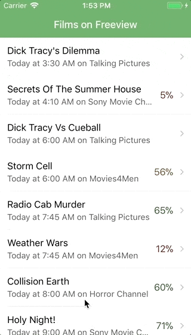

# Films on Freeview

This is a film listing guide app built with [React Native](https://facebook.github.io/react-native/) and
[Expo](https://expo.io/). It is intended to showcase the essential parts of a React Native app, integrated with
[Redux](https://redux.js.org/).

## Installation

* Ensure you have one of the following:
  * An iPhone with the [Expo](https://itunes.apple.com/app/apple-store/id982107779?mt=8) app
  * An Android phone with the [Expo](https://play.google.com/store/apps/details?id=host.exp.exponent) app
  * (Via [Xcode](https://developer.apple.com/xcode/)) the iOS Simulator with the [Expo](https://expo.io/tools) app
  * An Android emulator with the [Expo](https://expo.io/tools) app
    ([Genymotion emulator](https://www.genymotion.com/fun-zone/) is recommended)
* Ensure you have the following installed on your computer:
  * [Node.js](https://nodejs.org/)
  * [yarn](https://yarnpkg.com/)
  * [Google Chrome](https://google.com/chrome/)
* Clone this repository and `cd film-guide-app`
* Run `yarn` to install dependencies.

## Running app

* In your terminal, type `yarn start`.
* If you are using a device:
  * Ensure your device is on the same network as your computer.
  * Scan the resulting QR code with the Expo app. You should see the app appear in our device.
* If you have the iOS simulator installed, type `i` in the interactive prompt to open the app in the simulator.
* If you have an Android emulator installed, type `a` in the interactive prompt to open the app in the simulator.

## Troubleshooting

### Expo app can't connect to development server

* Ensure your computer and device are on the same network.
* If you are on Windows, and have VirtualBox or VMWare installed, `yarn start` might not work properly.
  [Follow these instructions to solve](https://github.com/react-community/create-react-native-app/issues/60#issuecomment-317104728).

## Notes

The app connects to a remote API to fetch the film guide. Sometimes this API can take a few seconds to respond, so
please be patient!

### Directory Structure

* `src/`: folder containing all JavaScript source files. Includes:
  * `components/`: standalone 'presentation' components. These components are assembled by parent screens, accepting
    props and communicating to the parent via callbacks.
  * `data/`: contains logic used to access the API.
  * `screens/`: top level screens, rendered by the navigator. These screens are Redux aware - their primary job is to
    take data from the Redux store and render a set of presentation components.
  * `store/`: contains all actions, reducer and selectors relating to the Redux store for the app.
  * `navigator.js`: configures the different screens in the app and how they should appear in the stack.
  * `theme.js`: contains all common styles for the app, to be used by the components.
* `.babelrc`: a config file used by the [Babel](https://babeljs.io/) transpiler.
* `.eslintrc`: a config file used by the [ESLint](https://eslint.org/) linter.
* `.flowconfig`: a config file used by the [Flow](https://flow.org/) static type checker.
* `.gitignore`: a file used by git to determine which files and folders should not be version controlled.
* `App.js`: the main application file. Here we import the Navigator and hook it up to the Redux store to maintain the
  app state.
* `app.json`: a config file used by the Expo app.
* `package.json`: a config file to store the project's dependencies and define scripts to be run with `yarn`.
* `yarn.lock`: a complete list of all dependencies used by the app, accessed by `yarn` when the development environment
  is initially set up.

### Development

The Expo client app enables _Live Reload_ by default. This means that any changes that are saved in your text editor
will cause the app on the device to be refreshed.

Shaking the device will reveal the Developer Menu, where you can manually reload, enable remote debugging and inspect
the component tree. Enabling remote JS debugging will open Google Chrome where you can step through your code and set
breakpoints.

## License

MIT
